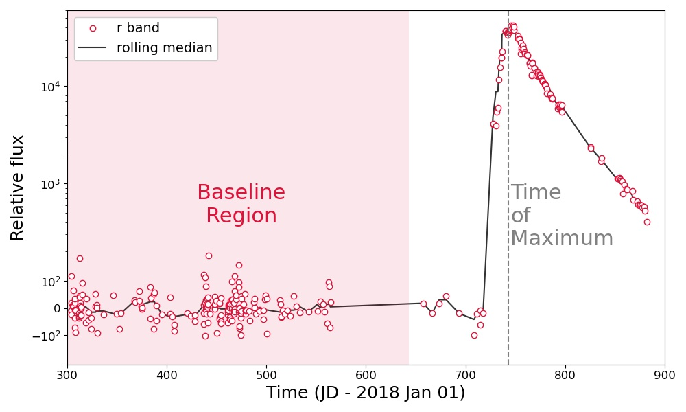
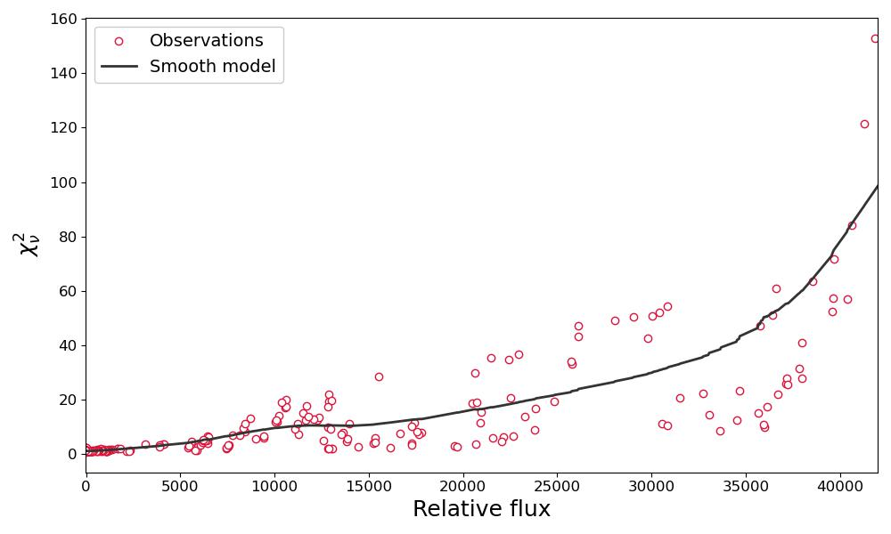

# ZTF fps

The IPAC forced photometry service (fps) produces fixed-position, "forced" photometry on existing difference images in the ZTF IPAC archive. The [IPAC fps documentation](http://web.ipac.caltech.edu/staff/fmasci/ztf/forcedphot.pdf) includes all the relevant details, here we provide a brief summary of the fps before describing the BTS light curve processing procedure.

 The fps takes a user-supplied position (and date range) and queries the ZTF subtraction image database for all images that contain the specified coordinates. PSF photometry is then measured at the specified position using the already-determined PSF model for the subtraction image. Results from these measurements are then returned in a standard IPAC table. There are many columns in the table, some of which are useful for flagging unreliable flux measurements, but the most important columns are: `jd`, `filter`, `zpdiff`, `forcediffimflux`, and `forcediffimfluxunc`.

While the fps provides both a zero-point and flux measurement, potential systematic offsets in the gain of the reference and new science images requires correction prior to measuring a calibrated flux. 

# BTS light curves

IPAC fps output requires a "baseline correction" ([see the docs](http://web.ipac.caltech.edu/staff/fmasci/ztf/forcedphot.pdf)). This baseline is best determined using a large (>~ 25) statistical sample of subtraction images that do not include emission from the transient of interest. Most transients have a suitable set of "pre-transient" images, but a significant fraction (e.g., many ZTF discoveries from 2018) require images taken long after the transient has faded. A suitable baseline can be identified visually, though with thousands of BTS transients we automate this procedure.

### Identifying unreliable observations

We attempt to identify observations that may not be reliable, providing users with the ability to remove these data from their analysis. Within this larger framework of warnings ([see below](../explanation#-flags-bitmask) for an explanation of all of the processing flags), we exclude all observations with `flags > 256` from our analysis. This corresponds to science images that do not pass the IPAC quality assurance thresholds and difference images for which the FPS does not provide any output, as highlighted in the figure below. Any such observations are excluded from the calculation of the baseline correction.

### Time of maximum

For individual transients we determine the time of maximum by calculating a running median with a 14 day window ( 7 day centered on the observations themselves) for every field + filter + chip + quadrant combination (designated `fcqfid`; see [Yao et al. 2019](http://dx.doi.org/10.3847/1538-4357/ab4cf5)) in the fps products. The estimated time of maximum is determined by taking the mean of the maximum rolling median value for any g-band or r-band fcqfids taken on the primary ZTF observing grid (see [Bellm et al. 2018](http://dx.doi.org/10.1088/1538-3873/aaecbe) for more details on the primary and secondary ZTF observing grids).

### Baseline correction
The baseline for each `fcqfid` is determined using observations obtained more than *100 d prior* to the estimated time of maximum light and long after the transient has faded below the ZTF detection threshold. The transient is (conservatively) determined to have faded below the detection threshold by assuming the peak luminosity of the transient is purely powered by radioactive 56Co, and we then calculate the time to fade to 22.5 mag in the observed frame assuming the transient is at z = 0.09 (this choice of redshift is conservative). The baseline correction `C` is estimated via the median `forcediffimflux` value in the baseline region. The uncertainty on `C` is estimated from 1000 bootstrap resamples of the baseline observations, where half the difference between the 16th and 84th percentiles of the bootstrap samples is taken as the uncertainty on `C`.

We provide several different warnings ([see the flags below](../explanation#-flags-bitmask)) when the baseline estimate may be unreliable. In particular, caution should be applied to any baseline estimates with (i) few observations (<25 or so; the `BaselineSmall` flag is associated with `fcqfid` where `C` is estimated from less than 10 observations); (ii) exceptionally large scatter (the `BaselineScatter` flag is associated with `fcqfid` where half the difference between the 16th and 84th percentiles of `forcediffimflux` values in the baseline region is > 100 DN), which indicates a time-variable background, such as a SN on top of an AGN; or (iii) evidence for excess flux in the baseline region. If there is evidence for emission in the pre-peak baseline region the `PreSNEmission` flag is raised, and only observations in the post-peak baseline region are used to estimate `C`. Similarly, if there is evidence for emission in the post-peak baseline region the `PostSNEmission` flag is raised, and only observations in the pre-peak baseline region are used to estimate `C`. If both the `PreSNEmission` and `PostSNEmission` flags are raised, `C` is estimated using observations from both regions.

If there are <2 observations in the baseline region, `C` is assumed to be zero. 

The figure below again shows SN 2019yvq, the running median used to determine the time of maximum and the baseline region used to determine `C`.

### Scaling the uncertainties

The reported flux uncertainties from the fps pipeline are based on a model of the noise in the difference and reference image. Systematic effects that are not modelled (e.g., errors in the PSF model, calibration uncertainties, etc) may cause the reported uncertainties to be underestimated. For each fps flux measurement the reduced chi-squared for the PSF model is reported. On an `fcqfid` basis, if the uncertainties are properly estimated then it is expected that the mean reduced  should be ~1 across all observations. In cases where the median reduced  is < 1.5, the fps flux uncertainties are all multiplied by the square root of the median reduced . 

Otherwise, it is assumed that there are flux-dependent systematics leading to an underestimation of the uncertainties. To remove this flux-dependent systematic, we use [SuperSmoother](https://github.com/jakevdp/supersmoother/) to estimate the reduced  as a function of flux for "good observations" (flags < 256). The uncertainties *of all observations* are multiplied by the square root of the smooth model of  as a function of flux.

### Calibrated fluxes

To produce the final calibrated flux measurements, the baseline value `C` is
subtracted from all flux measurements `forcediffimflux`. The uncertainties are
scaled (see above), and the flux in microJy is calculated as:

###  Flags Bitmask

While processing the output from the IPAC FPS, we flag observations that may not be reliable or that have a suspect calibration due to difficulties in estimating the baseline correction listed above. The output flags are: 

Flag Name | Flag value in binary form | Flag value in decimal form | Description of the flag
:---|---:|---:|:---
Default | 0x00000000000 | 0 | Initial value for all observations
TMaxScatter | 0x00000000001 | 1 | The estimated time of maximum varies significantly (> 10 d) for observations in the different filters
PreSNEmission | 0x00000000010 | 2 | Significant flux is detected in the baseline region prior to the SN peak
PostSNEmission | 0x00000000100 | 4 | Significant flux is detected in the baseline region prior to the SN peak
BaselineOutlier | 0x00000001000 | 8 | Observation is not consistent with the estimated baseline at the 5-sigma level
BaselineScatter | 0x00000010000 | 16 | Unusually large scatter in the flux measurements in the baseline region
BaselineSmall | 0x00000100000 | 32 | There are fewer than 10 observations used to define the baseline region
NoisyImage | 0x00001000000 | 64 | Robust sigma per pixel in sci image (`scisigpix`) exceeds 25
BadSeeing | 0x00010000000 | 128 | Seeing in the science image is > 5 arcsec
UnderestimatedUnc | 0x00100000000 | 256 | The uncertainties are systematically underestimated based on the  per degree of freedom in the baseline region
FailedImage | 0x01000000000 | 512 | Processing summary and quality assurance for the science image has been flagged (infobits > 0)
FailedMeasurement | 0x10000000000 | 1024 | FPS processing fails and no flux measurement is made

The `PreSNEmission` and `PostSNEmission` flags were designed to identify sources with exceptionally long rise and decline times, respectively. These flags can also identify sources that flare before or after the primary peak of the transient. 

[Yao et al. (2019)](http://dx.doi.org/10.3847/1538-4357/ab4cf5) caution against using observations with a large `scisigpix` or large `seeing`, which is why we include the `NoisyImage` and `BadSeeing` flags. 

A non-zero value for `infobits` typically indicates a problem with the IPAC data processing pipeline, hence the `FailedImage` flag. `infobits` > 33554432 corresponds to "bad-data" quality flag (see Section 2.4 of the [ZTF Science Data System (ZSDS) Advisories & Cautionary Notes](http://web.ipac.caltech.edu/staff/fmasci/ztf/extended_cautionary_notes.pdf)). 

## Final product

The final output from this procedure includes a csv file `ZTFYYnnnnnnn_fnu.csv` with nine columns:

1. JD - Julian date of the observation
2. fnu_microJy - the flux in microJy
3. fnu_microJy_unc - the uncertainty on the flux in microJy
4. passband - the filter of the observations (ZTF_g, ZTF_r, or ZTF_i)
5. programid - Program identifier (0 = engineering; 1 = public; 2 = private; 3 = Caltech time) ([see IPAC fps documentation](http://web.ipac.caltech.edu/staff/fmasci/ztf/forcedphot.pdf))
6. fcqfid - field + filter + ccd + quadrant combination ([see above](../explanation#time-of-maximum))
7. zpdiff - photometric zeropoint for difference image
8. sys_unc_factor - systematic uncertainty used for scaling ([see above](../explanation#scaling-the-uncertainties))
9. flags - bitmask containing  [see above](../explanation#-flags-bitmask)